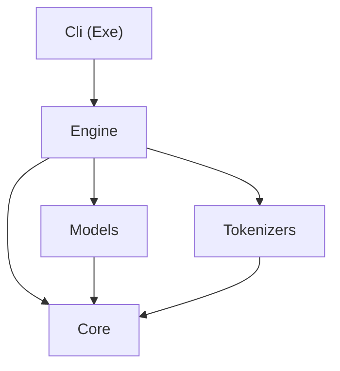

# Solution and project layout

- Status: proposed
- Date: 2026-08-11

## Context and Problem Statement

We need a `src/` layout to start writing code against. This is a **simple, educational**
project: we are not reinventing an inference engine from scratch — we reuse a standard model
format (GGUF or SafeTensors) and existing libraries wherever reasonable, and spend our effort
on *understanding how the pieces fit together and which part of the code is responsible for
what* (see AGENTS.md).

dotLLM (our reference architecture) ships as ~17 projects — the main library layers being
Core, Tokenizers, Cpu, HuggingFace, Diagnostics, Telemetry, Models, Engine, Cuda, Server, and
Cli (see [dotllm-architecture-trace.md](../investigation/dotllm-architecture-trace.md)). What
project layout gives us clear, understandable boundaries without either being a single
undifferentiated blob or copying dotLLM's full package surface before we've written a line of
engine code?

The *problems* each layer has to solve (model acquisition, loading, tokenization, attention,
KV-cache, sampling, performance, serving) and our high-level strategy for them are covered
separately in
[260901-project-challenges-and-how-to-address-them.md](260901-project-challenges-and-how-to-address-them.md);
this ADR is only about the project **structure** and **responsibilities**.

## Decision Drivers

- Reuse libraries for model loading, tokenization, and math — we are not writing custom
  SIMD/CUDA kernels, so there's no driver for `Cpu`/`Cuda` backend projects yet.
- Keep the boundaries that actually matter for *understanding* the architecture visible as
  project boundaries (model loading vs. tokenization vs. orchestration/sampling/KV-cache),
  since that separation is the main learning goal.
- Avoid scaffolding layers with no near-term content (a `Server` project before a working
  generation loop exists is premature) — matches our own "no speculative abstractions" rule.
- Something runnable end-to-end early: a CLI that loads a model and generates tokens is more
  useful for learning than a set of empty libraries.

## Considered Options

- Option A: Single console project, everything inline.
- Option B: Layered class libraries mirroring a scoped-down subset of dotLLM (Core, Models,
  Tokenizers, Engine, Cli), no Cpu/Cuda/Server/HuggingFace/Diagnostics yet.
- Option C: Full dotLLM-style layering from day one (all ~17 projects).

## Decision Outcome

Chosen option: "Option B", because it mirrors the reference architecture closely enough to
stay legible against dotLLM's design (the whole point of using it as a map), but doesn't
build out layers we have no content for yet. Cpu/Cuda kernel projects contradict the
library-reuse goal; Server, HuggingFace, and Diagnostics are follow-on concerns once a basic
generate-loop exists.

Projects, each a class library targeting `net10.0` unless noted, referencing only the layers
below them. Each entry states what it **owns** and who it **calls**:

- `InferenceEngine.Core` — **owns** the shared vocabulary: tensor/config value types,
  `IModel`, `ITokenizer`, `ModelConfig`, and the other contracts the layers exchange.
  **Calls** nothing — it is the leaf, so every other project can depend on it without cycles.
- `InferenceEngine.Models` — **owns** model loading: format parsing (GGUF/SafeTensors) and
  memory-mapping the weight blob, done via a library rather than a hand-rolled parser (library
  choice is its own future ADR). Produces an `IModel` and runs its `Forward` pass. **Calls**
  `Core` only.
- `InferenceEngine.Tokenizers` — **owns** tokenization: encoding text to token ids and back,
  via a library where a suitable one exists (library choice is its own future ADR). **Calls**
  `Core` only.
- `InferenceEngine.Engine` — **owns** orchestration: the generation loop, sampling
  (temperature/top-k/top-p), and the KV-cache. This is the aggregation layer — it exposes the
  facade the CLI drives (create a session from a model path, then generate) and is the only
  place that knows about both loading and tokenization at once. **Calls** `Core`, `Models`,
  `Tokenizers`.
- `InferenceEngine.Cli` — **owns** the process entry point: argument parsing and console I/O,
  nothing else. **Calls** `Engine` only (it deliberately does *not* reference `Models` or
  `Tokenizers` — all loading is funneled through the `Engine` facade). Executable
  (`OutputType=Exe`).

Solution file `InferenceEngine.sln` at the repo root, with solution folders matching the
project names above, `src/<ProjectName>/<ProjectName>.csproj` on disk. A root
`Directory.Build.props` sets shared settings (nullable enable, implicit usings enable,
current C# language version) so individual `.csproj` files stay minimal.

### Project reference graph

Arrows point from a project to what it depends on. References only ever go "down" the stack,
so there are no cycles and `Core` stays dependency-free.

### Which project is responsible for what

| Concern | Owning project | Why it's there |
|---------|----------------|----------------|
| Shared types / interfaces (`IModel`, `ITokenizer`, tensors, `ModelConfig`) | `Core` | Leaf with no deps, so every layer shares one vocabulary without cycles |
| Format parsing + weight memory-mapping | `Models` | Loading is one bounded concern; keeps format details out of the generate loop |
| Encode / decode, BPE vocab + merges | `Tokenizers` | Tokenization is independent of model math; swappable library |
| Generation loop, sampling, KV-cache | `Engine` | The orchestration that ties loading + tokenizing into a token stream |
| Arg parsing, console I/O, streaming output | `Cli` | Keeps process concerns out of the libraries; makes `Engine` reusable |

### Consequences

- Good, because the project boundaries map directly onto the concepts we're trying to
  understand (loading vs. tokenizing vs. orchestrating), which is the point of the exercise.
- Good, because `Cli` gives an early, runnable end-to-end target instead of a pile of
  libraries with nothing wiring them together.
- Good, because routing all loading through the `Engine` facade (rather than letting `Cli`
  reference `Models`/`Tokenizers`) keeps `Engine` reusable by a future server or test harness
  without dragging in console concerns.
- Bad, because if we later *do* want a custom CPU/CUDA kernel experiment or a server, we'll
  add those projects then — this ADR doesn't pre-approve that; it'll need its own decision
  when it has real content.
- Bad, because five projects for essentially no code yet is more ceremony than Option A. We
  accept this because the separation is deliberate and we'd have to introduce it very soon
  anyway once real content lands in each layer.

## Pros and Cons of the Options

### Option A: Single console project

- Good, because zero ceremony, fastest to start writing code.
- Bad, because it actively works against the learning goal — no visible boundary between
  "this is model loading" and "this is sampling logic" as the code grows.

### Option B: Scoped-down layered libraries (chosen)

- Good, because it mirrors dotLLM's architecture (our reference) at a scope matching our
  actual goals.
- Bad, because it's more upfront structure than we have code to fill, today.

### Option C: Full dotLLM-style layering (~17 projects)

- Good, because it's a complete match to the reference architecture, nothing to add later.
- Bad, because `Cpu`/`Cuda` custom kernels directly contradict the "reuse libraries, don't
  hand-roll math kernels" goal from AGENTS.md; `Server`/`HuggingFace`/`Diagnostics`/`Telemetry`
  have no content until the core loop works. Building empty shells for all of these is exactly
  the kind of speculative scaffolding our working-style rules say to avoid.

## More Information

- [260901-project-challenges-and-how-to-address-them.md](260901-project-challenges-and-how-to-address-them.md)
  — the problems each layer solves, our build-vs-reuse strategy, and how other engines are
  structured.
- Reference architecture trace: [dotllm-architecture-trace.md](../investigation/dotllm-architecture-trace.md).
- [dotLLM](https://github.com/kkokosa/dotLLM) project structure (see README.md).
- Library choices for `Models` (format loading) and `Tokenizers` are deferred to their own ADRs.

## Decision Log

| Date       | Change            | By              |
|------------|-------------------|-----------------|
| 2026-08-11 | Initial proposal  | Claude (agent)  |
| 2026-09-01 | Renamed to the `YYMMDD-<slug>` convention; corrected dotLLM project count (10 → ~17); added a project-reference diagram and a "which project is responsible for what" table; moved the engineering challenges, external-dependency flow, and reference-project comparison out to the new challenges ADR (260901) | Claude (agent) |
