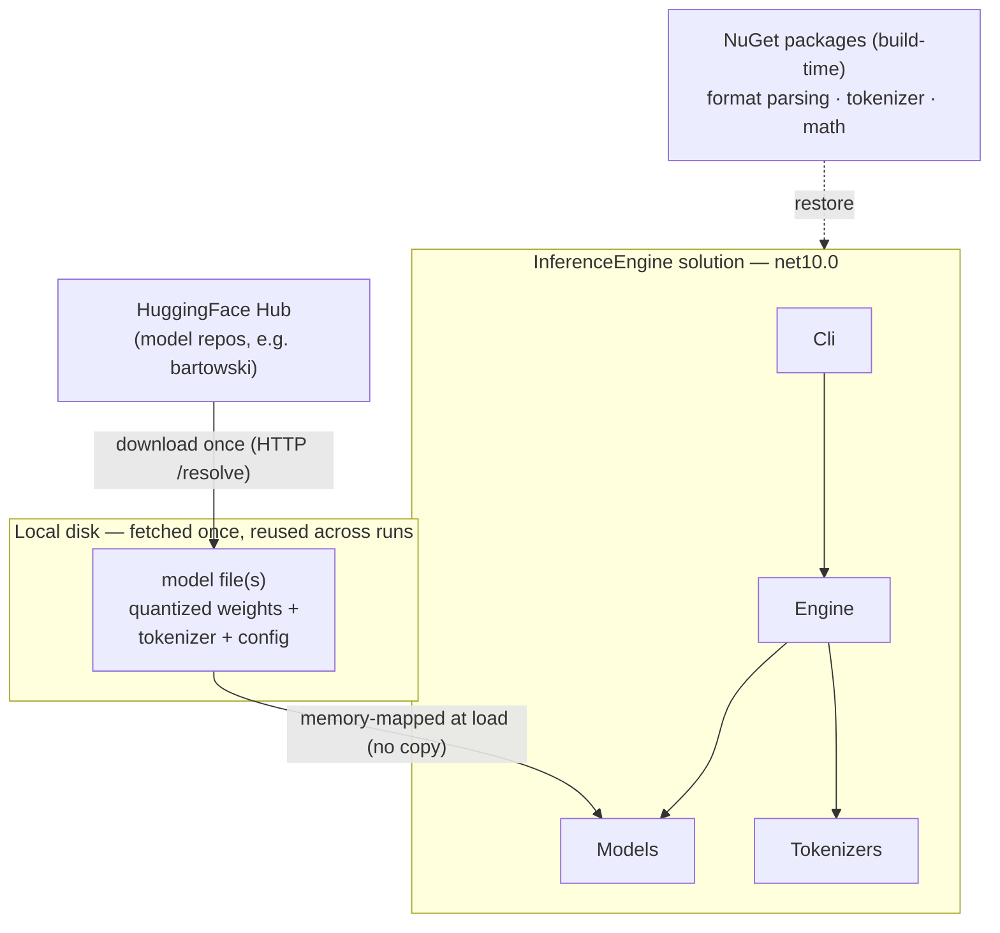
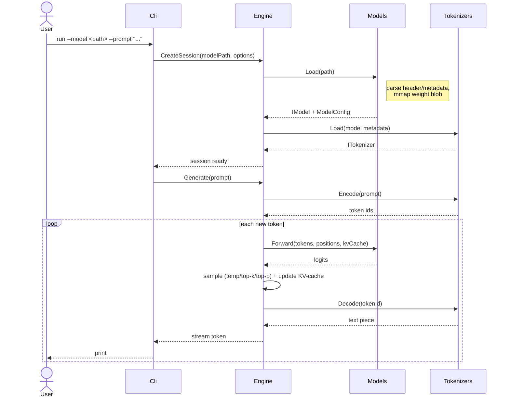

# Project challenges and how to address them

- Status: proposed
- Date: 2026-09-01

## Context and Problem Statement

[260811](260811-solution-and-project-layout.md) decided the project *structure* (five layers:
Core, Models, Tokenizers, Engine, Cli). It did not say what hard problems those layers actually
have to solve, nor how much of each we intend to **build ourselves** versus **reuse from a
library**. Running an LLM forward is a chain of distinct problems:

- **Model acquisition** — getting the weights onto the machine and knowing where they live.
- **Model loading** — parsing a model file, reading its config, getting the weights into memory.
- **Tokenization** — turning text into token ids and back (BPE / SentencePiece).
- **Transformer forward pass** — the math: embeddings, RMSNorm, RoPE, attention (MHA/GQA/MQA),
  SwiGLU FFN, final projection to logits.
- **KV-cache** — reusing past keys/values so decode is O(1) per token instead of O(n).
- **Sampling / logits processing** — temperature, top-k, top-p, repetition penalties.
- **Orchestration** — the generation loop that ties encode → forward → sample → decode into a
  streamed token sequence.
- **Performance** — tokens/second, memory bandwidth vs. compute, mmap, GC pressure.
- **Serving** — (later) an HTTP API.

The question this ADR answers: **given the educational goal, how much do we build versus reuse
for each of these, and which project owns each concern?** The per-component ADRs that follow
each drill into one of these; this one is the shared, high-level map they hang off.

## Decision Drivers

- **Effort vs. understanding — the governing principle.** For each challenge, weigh the *effort
  to build it ourselves correctly* against *how much building it (rather than reading about it)
  actually teaches us about inference*. Build where the payoff is high; reuse where the effort is
  high or the work is pure plumbing. The decision below is derived from this weighing, not
  assumed.
- **Educational clarity** — the code we do own should read as an explanation of inference, not
  as a wrapper call.
- **Managed-first, no custom SIMD/CUDA** without explicit sign-off. This is consistent with
  AGENTS.md, but here it *falls out of* the effort/payoff weighing rather than being taken as a
  given (see the kernel rows below).
- **Benchmarked against dotLLM**, which sets a realistic bar for what a pure-.NET engine costs
  in effort and buys in speed.

## Considered Options

- **Option A — Wrap a native runtime.** Bind llama.cpp or ONNX Runtime and drive it (the
  LLamaSharp / ONNX Runtime GenAI / LM-Kit.NET approach).
- **Option B — Reuse libraries for the mechanical parts, build the orchestration and math
  ourselves.** Standard format + parsing/tokenizer/math libraries; hand-write the forward pass,
  KV-cache, sampling, and generation loop.
- **Option C — Ground-up everything, including kernels.** Own format parser, own SIMD/CUDA math
  (the dotLLM / Jlama approach).

## Decision Outcome

Chosen option: **Option B**, reached by weighing each challenge's build effort against its
understanding payoff (table below) — not by rule. The two extremes lose on that trade: **Option
A** reuses away the high-payoff pieces, so it costs almost no build effort but teaches API usage
instead of inference; **Option C** spends its *extra* effort over B almost entirely on the pieces
with the lowest incremental payoff *for us* — kernel micro-optimization — which is a project in
itself. Option B sits on the efficient frontier: build where the payoff is high and the effort
is manageable, reuse where the effort is high or the work is pure plumbing.

### Effort vs. understanding, per challenge

"Build effort" is the cost of writing it ourselves *correctly*; "payoff" is how much building it,
rather than reading about it, actually teaches us about how inference works.

| Challenge | Build effort | Payoff of building | Verdict |
|-----------|--------------|--------------------|---------|
| Format parsing (GGUF/SafeTensors bytes) | Medium — fiddly binary, endianness, quant block layouts | Low — the layout is learned from the spec; the reader itself is toil | **Reuse** |
| Tokenization (BPE merges + pre-tokenizer) | Medium–High — pre-tokenizer regex, merge ranking, many edge cases | Low–Medium — the concept is simple; the effort is correctness, not insight | **Reuse** |
| Model acquisition / download | Low–Medium | Low — it's HTTP plus a cache | **Reuse** |
| Low-level math (GEMM/GEMV, dequant) | High — SIMD, cache tiling, quant-aware kernels | Medium — we care about the dataflow and memory movement, not squeezing AVX-512 | **Reuse** (math lib) |
| Forward pass / attention wiring | Medium — compose matmuls into RMSNorm/RoPE/GQA/SwiGLU | **High** — this *is* the transformer | **Build** |
| KV-cache | Low–Medium — start contiguous | **High** — explains why decode is O(1) per token | **Build** |
| Sampling / logits | Low | **High** — temperature/top-k/top-p is core and cheap to build | **Build** |
| Orchestration / generation loop | Low–Medium | **High** — how the pieces become a token stream | **Build** |
| Serving (HTTP API) | Medium | Low — not an inference internal | **Defer** |
| CUDA kernels | Very High | Low for a CPU-first learning project | **Skip** |

The build-vs-reuse column below restates those verdicts as concrete project assignments; each
row gets its own future ADR:

| Challenge | Approach | Owning project | Follow-up ADR |
|-----------|----------|----------------|---------------|
| Model acquisition | Reuse: download once from HuggingFace into a local cache, reuse across runs | `Cli` (hands `Models` a local path) | [HuggingFace acquisition](planned-huggingface-acquisition.md) |
| Model loading | Reuse a parsing library; mmap the weight blob (no copy) | `Models` | [Format loading](planned-format-loading.md) |
| Tokenization | Reuse a tokenizer library (BPE/SPM) | `Tokenizers` | [Tokenization](planned-tokenization.md) |
| Transformer forward pass / attention | **Build** on top of a math library (no custom kernels) | `Models` (+ `Core` types) | [Attention & transformer](planned-attention-and-transformer.md) |
| KV-cache | **Build** — start simple (contiguous), understand before optimizing | `Engine` | [KV-cache](planned-kv-cache.md) |
| Sampling / logits | **Build** — composable temp/top-k/top-p chain | `Engine` | [Sampling pipeline](planned-sampling-pipeline.md) |
| Orchestration / generation loop | **Build** — the facade + streamed decode loop | `Engine` | (covered by structure + this ADR) |
| Performance | Measure against dotLLM; managed-first, `unsafe` only with sign-off | cross-cutting | [Performance baseline](planned-performance-baseline.md) |
| Serving | Deferred until the generate loop works | (future `Server`) | (future) |

### Model acquisition: what we fetch and where it lives

The one thing we cannot reuse-away is the model itself. Two external inputs feed a run:

- **NuGet packages** at build time — the parsing, tokenizer, and math libraries. Restored once,
  cached normally.
- **Model weights** at first use — a single model file (a GGUF file is self-contained: quantized
  weights *plus* embedded tokenizer vocab/merges *plus* the architecture config, so one download
  is the whole model; SafeTensors typically pairs the weights with sidecar tokenizer/config
  files).

The weights are **downloaded once** into a local cache and **reused on every subsequent run** —
not re-fetched each time — and are **memory-mapped** at load (the OS pages them in on demand),
so "loading" a multi-GB model is near-instant and adds no GC pressure. The exact format pick
(GGUF vs. SafeTensors), cache path, and download library are decided in their own ADRs; this one
only fixes that weights are an external, **fetch-once, mmap-at-load** dependency owned by
`Models`.

### How a run executes

The build-vs-reuse split shows up at runtime as: `Cli` only does I/O, `Engine` orchestrates and
owns everything we built (loop, sampling, KV-cache), and the reused pieces (`Models` loading,
`Tokenizers`) stay behind `Core`'s interfaces.

### Consequences

Legend: 🟢 upside · 🟡 accepted trade-off · 🔴 downside.

- 🟢 every conceptually interesting piece (loading semantics, attention, KV-cache,
  sampling, the loop) is our own readable C# — which is the whole point.
- 🟢 we skip the two things that are pure toil and easy to get subtly wrong: byte-level
  format parsing and the tokenizer merge machinery.
- 🟢 it sets a clear rule for future ADRs: "does this help us understand inference?"
  decides build vs. reuse, rather than case-by-case debate.
- 🟡 building the forward pass on a general math library (not tuned kernels) will be
  slower than dotLLM/llama.cpp — accepted; we measure the gap rather than close it.
- 🟡 "reuse the mechanical parts" still leaves a real amount to build (Engine is not
  small). Accepted — that's where the learning is.

## Pros and Cons of the Options

Grounded in how other engines actually split build-vs-reuse and structure; see
[inference-engine-project-layouts.md](../investigation/inference-engine-project-layouts.md) for
sources.

### Option A — Wrap a native runtime

- 🟢 it's the least build effort *and* the fastest, most robust result — LLamaSharp
  (binds llama.cpp) and ONNX Runtime GenAI (wraps ONNX Runtime) are mature and performant.
- 🔴 that near-zero effort buys near-zero understanding: the high-payoff pieces
  (forward pass, attention, KV-cache, sampling) all execute *inside* the native library, so we'd
  learn its API, not inference. It optimizes the one thing we're not here to minimize.

### Option B — Reuse the mechanical parts, build the rest (chosen)

- 🟢 it draws the line exactly at the learning goal: reuse parsing/tokenizer/math,
  build loop/attention/KV-cache/sampling.
- 🟢 it matches a realistic module count — comparable to Jlama's ~6 real modules,
  far lighter than dotLLM's ~17 or LLamaSharp's deployment-target sprawl.
- 🟡 performance will trail the ground-up SIMD engines; we accept and measure it.

### Option C — Ground-up everything, including kernels

- 🟢 it has the highest understanding ceiling — dotLLM (custom SIMD + CUDA) and the
  Java engines (Jlama, llama3.java, both hand-rolling Vector-API kernels) show it's achievable in
  a managed runtime.
- 🔴 on the effort/payoff trade: everything Option C adds over Option B is high-effort,
  low-incremental-payoff kernel work (SIMD tiling, quant-aware GEMV, optional CUDA). We already
  get the transformer's *dataflow* from building the forward pass on a math library in Option B;
  hand-writing the multiply underneath it mostly teaches performance engineering, a different
  subject. High cost for marginal conceptual gain — which is also why AGENTS.md defaults to reuse.

## More Information

- [260811-solution-and-project-layout.md](260811-solution-and-project-layout.md) — the project
  structure these challenges are assigned to.
- [inference-engine-project-layouts.md](../investigation/inference-engine-project-layouts.md) —
  how dotLLM, Jlama, llama3.java, LLamaSharp, ONNX Runtime GenAI, and LM-Kit.NET are structured
  (build-vs-reuse, module granularity), with sources.
- [dotllm-architecture-trace.md](../investigation/dotllm-architecture-trace.md),
  [gguf-format-research.md](../investigation/gguf-format-research.md),
  [huggingface-ecosystem.md](../investigation/huggingface-ecosystem.md) — supporting research.
- Each challenge in the table above gets its own ADR; see
  [investigation/status.md](../investigation/status.md) for the running list.

## Decision Log

| Date       | Change            | By                 |
|------------|-------------------|--------------------|
| 2026-09-01 | Initial proposal  | Aleksei Kolesnikov |
