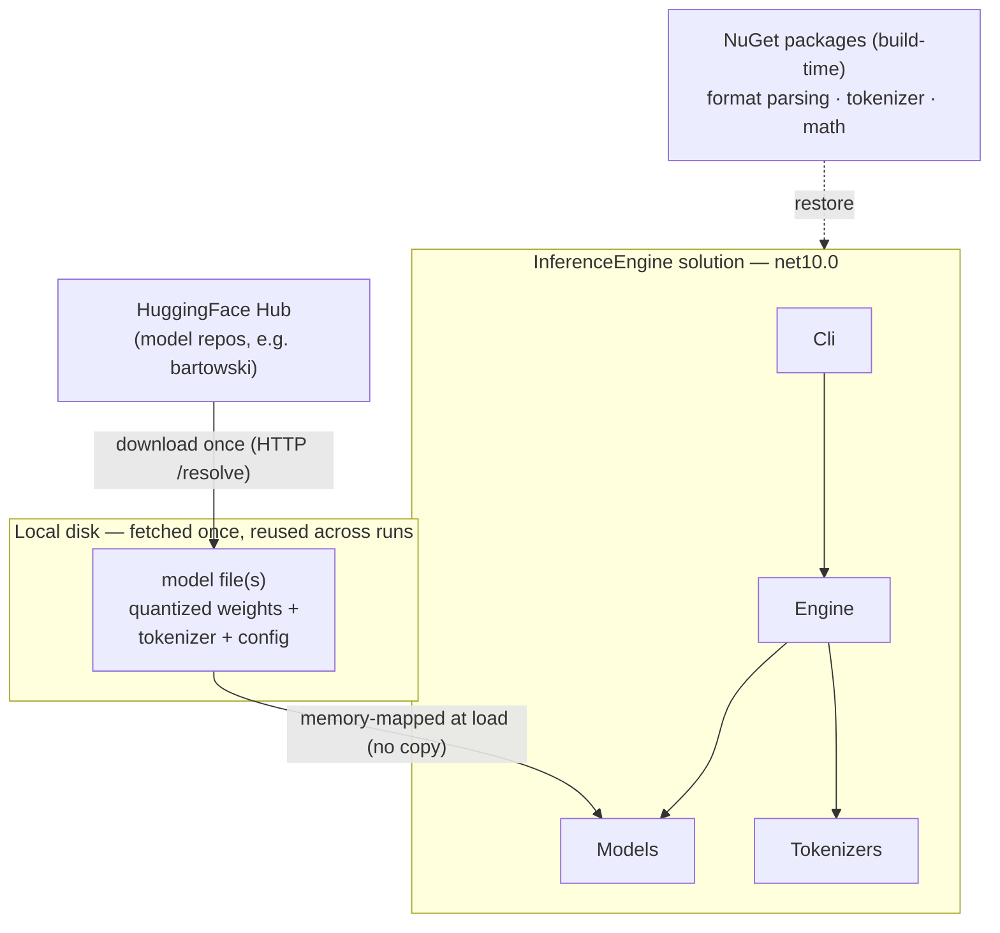
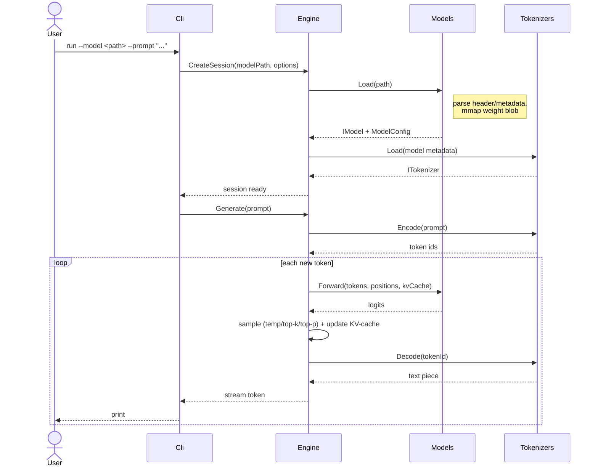

# Project challenges and how to address them

- Status: proposed
- Date: 2026-09-01

## Context and Problem Statement

[260811](260811-solution-and-project-layout.md) decided the project *structure* (five layers:
Core, Models, Tokenizers, Engine, Cli). It did not say what hard problems those layers actually
have to solve, nor how much of each we intend to **build ourselves** versus **reuse from a
library**. Running an LLM forward is a chain of distinct problems:

- **Model acquisition** — getting the weights onto the machine and knowing where they live.
- **Model loading** — parsing a model file, reading its config, getting the weights into memory.
- **Tokenization** — turning text into token ids and back (BPE / SentencePiece).
- **Transformer forward pass** — the math: embeddings, RMSNorm, RoPE, attention (MHA/GQA/MQA),
  SwiGLU FFN, final projection to logits.
- **KV-cache** — reusing past keys/values so decode is O(1) per token instead of O(n).
- **Sampling / logits processing** — temperature, top-k, top-p, repetition penalties.
- **Orchestration** — the generation loop that ties encode → forward → sample → decode into a
  streamed token sequence.
- **Performance** — tokens/second, memory bandwidth vs. compute, mmap, GC pressure.
- **Serving** — (later) an HTTP API.

The question this ADR answers: **given the educational goal, how much do we build versus reuse
for each of these, and which project owns each concern?** The per-component ADRs that follow
each drill into one of these; this one is the shared, high-level map they hang off.

## Decision Drivers

- **Educational clarity first.** The point is to *understand* each piece well enough to explain
  it — so anything essential to that understanding (the generation loop, attention, sampling,
  KV-cache) we build ourselves; anything that's mechanical plumbing (byte-level format parsing,
  BPE merge tables, low-level BLAS) we reuse.
- **Reuse libraries over reimplementing** math/tokenization/model-parsing kernels (AGENTS.md).
- **No custom SIMD/CUDA** kernels unless a specific learning goal demands it, and only with
  explicit sign-off (AGENTS.md `unsafe` policy).
- **Benchmarked against dotLLM**, which sets a realistic bar for a pure-.NET engine.

## Considered Options

- **Option A — Wrap a native runtime.** Bind llama.cpp or ONNX Runtime and drive it (the
  LLamaSharp / ONNX Runtime GenAI / LM-Kit.NET approach).
- **Option B — Reuse libraries for the mechanical parts, build the orchestration and math
  ourselves.** Standard format + parsing/tokenizer/math libraries; hand-write the forward pass,
  KV-cache, sampling, and generation loop.
- **Option C — Ground-up everything, including kernels.** Own format parser, own SIMD/CUDA math
  (the dotLLM / Jlama approach).

## Decision Outcome

Chosen option: **Option B**. Option A hides exactly the internals we're here to learn (the
generative loop, attention, sampling all live inside the native library). Option C is a much
larger project than "understand how it works" warrants and pulls us into writing and tuning
kernels — explicitly out of scope per AGENTS.md. Option B keeps the mechanical plumbing off our
plate while leaving every *conceptually interesting* piece as our own readable C#.

Concretely, each challenge maps to an owning project and a build-vs-reuse stance. Each row gets
its own future ADR:

| Challenge | Approach | Owning project | Follow-up ADR |
|-----------|----------|----------------|---------------|
| Model acquisition | Reuse: download once from HuggingFace into a local cache, reuse across runs | `Cli` / `Models` | HuggingFace acquisition |
| Model loading | Reuse a parsing library; mmap the weight blob (no copy) | `Models` | Format loading |
| Tokenization | Reuse a tokenizer library (BPE/SPM) | `Tokenizers` | Tokenization |
| Transformer forward pass / attention | **Build** on top of a math library (no custom kernels) | `Models` (+ `Core` types) | Attention & transformer |
| KV-cache | **Build** — start simple (contiguous), understand before optimizing | `Engine` | KV-cache |
| Sampling / logits | **Build** — composable temp/top-k/top-p chain | `Engine` | Sampling pipeline |
| Orchestration / generation loop | **Build** — the facade + streamed decode loop | `Engine` | (covered by structure + this ADR) |
| Performance | Measure against dotLLM; managed-first, `unsafe` only with sign-off | cross-cutting | Performance baseline |
| Serving | Deferred until the generate loop works | (future `Server`) | (future) |

### Model acquisition: what we fetch and where it lives

The one thing we cannot reuse-away is the model itself. Two external inputs feed a run:

- **NuGet packages** at build time — the parsing, tokenizer, and math libraries. Restored once,
  cached normally.
- **Model weights** at first use — a single model file (a GGUF file is self-contained: quantized
  weights *plus* embedded tokenizer vocab/merges *plus* the architecture config, so one download
  is the whole model; SafeTensors typically pairs the weights with sidecar tokenizer/config
  files).

The weights are **downloaded once** into a local cache and **reused on every subsequent run** —
not re-fetched each time — and are **memory-mapped** at load (the OS pages them in on demand),
so "loading" a multi-GB model is near-instant and adds no GC pressure. The exact format pick
(GGUF vs. SafeTensors), cache path, and download library are decided in their own ADRs; this one
only fixes that weights are an external, **fetch-once, mmap-at-load** dependency owned by
`Models`.

### How a run executes

The build-vs-reuse split shows up at runtime as: `Cli` only does I/O, `Engine` orchestrates and
owns everything we built (loop, sampling, KV-cache), and the reused pieces (`Models` loading,
`Tokenizers`) stay behind `Core`'s interfaces.

### Consequences

- Good, because every conceptually interesting piece (loading semantics, attention, KV-cache,
  sampling, the loop) is our own readable C# — which is the whole point.
- Good, because we skip the two things that are pure toil and easy to get subtly wrong: byte-level
  format parsing and the tokenizer merge machinery.
- Good, because it sets a clear rule for future ADRs: "does this help us understand inference?"
  decides build vs. reuse, rather than case-by-case debate.
- Bad, because building the forward pass on a general math library (not tuned kernels) will be
  slower than dotLLM/llama.cpp — accepted; we measure the gap rather than close it.
- Bad, because "reuse the mechanical parts" still leaves a real amount to build (Engine is not
  small). Accepted — that's where the learning is.

## Pros and Cons of the Options

Grounded in how other engines actually split build-vs-reuse and structure; see
[inference-engine-project-layouts.md](../investigation/inference-engine-project-layouts.md) for
sources.

### Option A — Wrap a native runtime

- Good, because it's the fastest path to a working, *fast* engine — LLamaSharp (binds llama.cpp)
  and ONNX Runtime GenAI (wraps ONNX Runtime) are mature and performant.
- Bad, because the internals we want to learn live *inside* the native library — wrapping it
  teaches API usage, not how inference works. Directly defeats the project's purpose.

### Option B — Reuse the mechanical parts, build the rest (chosen)

- Good, because it draws the line exactly at the learning goal: reuse parsing/tokenizer/math,
  build loop/attention/KV-cache/sampling.
- Good, because it matches a realistic module count — comparable to Jlama's ~6 real modules,
  far lighter than dotLLM's ~17 or LLamaSharp's deployment-target sprawl.
- Bad, because performance will trail the ground-up SIMD engines; we accept and measure it.

### Option C — Ground-up everything, including kernels

- Good, because it's the most complete understanding — dotLLM (custom SIMD + CUDA) and the Java
  engines (Jlama, llama3.java, both hand-rolling Vector-API kernels) show it's achievable in a
  managed runtime.
- Bad, because writing and tuning kernels is a project in itself and contradicts AGENTS.md's
  reuse-over-reimplement and `unsafe`-only-when-justified rules. Out of scope for "understand
  how it works."

## More Information

- [260811-solution-and-project-layout.md](260811-solution-and-project-layout.md) — the project
  structure these challenges are assigned to.
- [inference-engine-project-layouts.md](../investigation/inference-engine-project-layouts.md) —
  how dotLLM, Jlama, llama3.java, LLamaSharp, ONNX Runtime GenAI, and LM-Kit.NET are structured
  (build-vs-reuse, module granularity), with sources.
- [dotllm-architecture-trace.md](../investigation/dotllm-architecture-trace.md),
  [gguf-format-research.md](../investigation/gguf-format-research.md),
  [huggingface-ecosystem.md](../investigation/huggingface-ecosystem.md) — supporting research.
- Each challenge in the table above gets its own ADR; see
  [investigation/status.md](../investigation/status.md) for the running list.

## Decision Log

| Date       | Change            | By              |
|------------|-------------------|-----------------|
| 2026-09-01 | Initial proposal  | Claude (agent)  |
